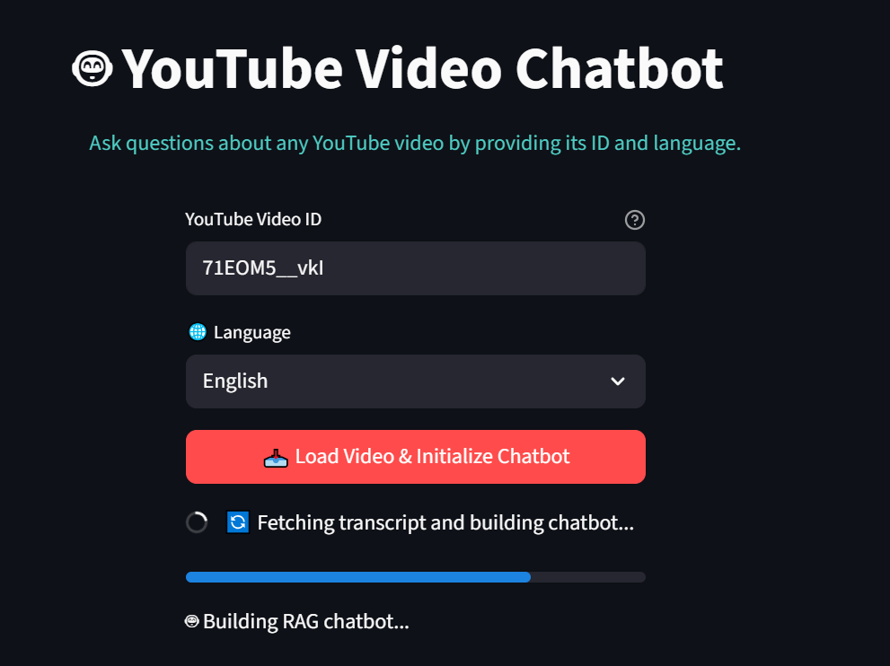
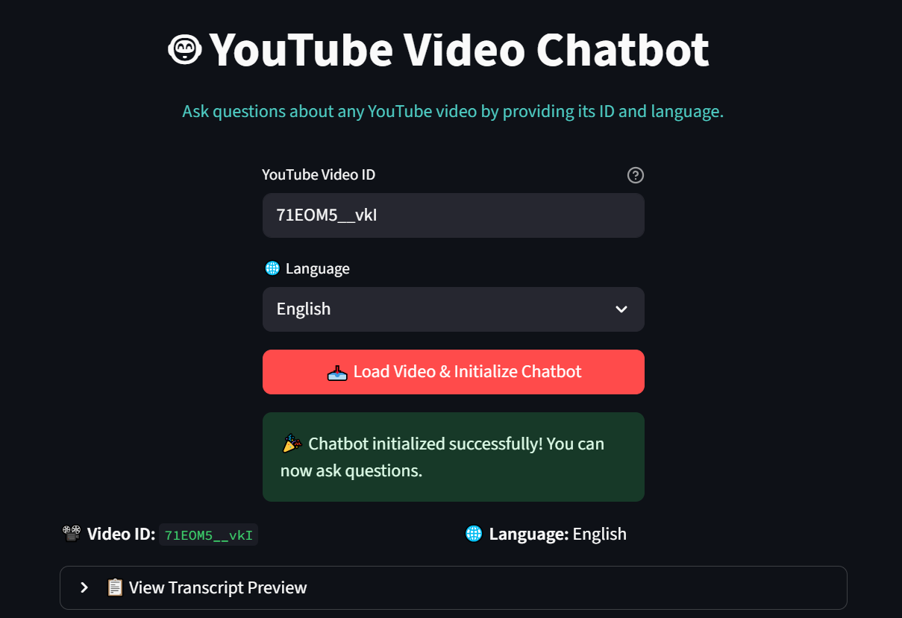
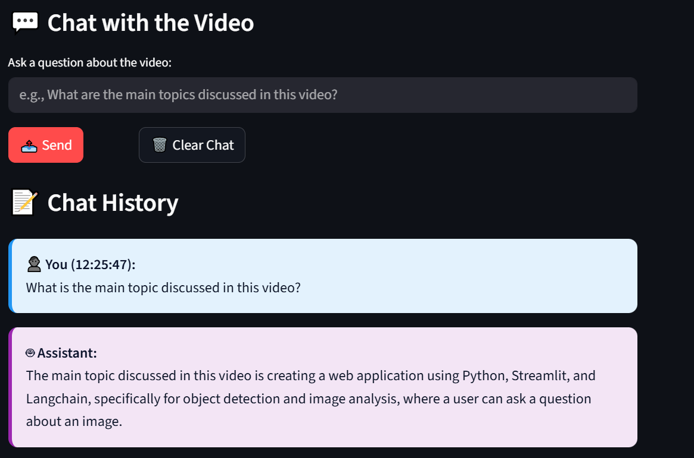
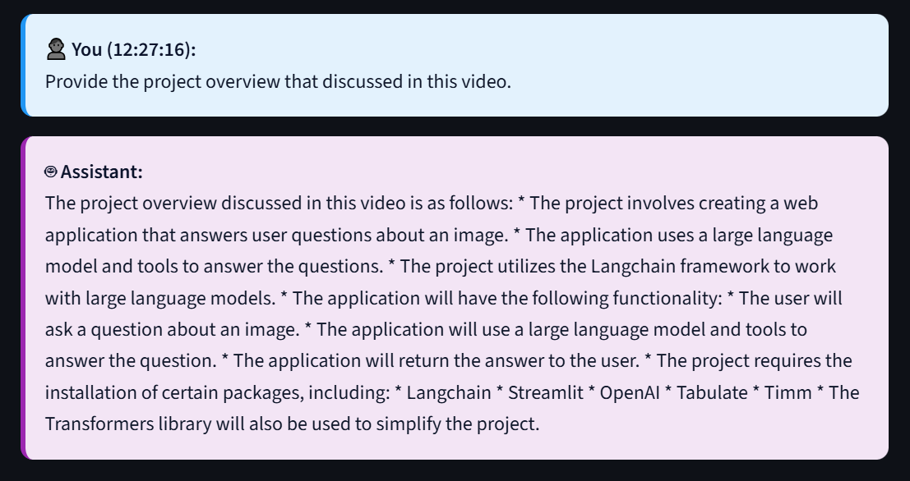
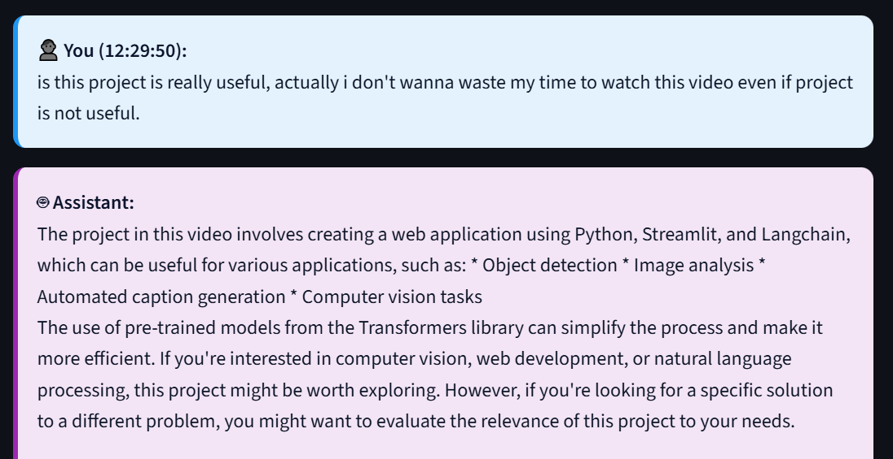

# 🤖 YouTube Video Chatbot

An AI-powered chatbot that lets you **interact with YouTube videos** by asking natural language questions.  
Simply provide a YouTube video ID, fetch its transcript (in multiple languages), and the chatbot will answer your queries **based strictly on the video content** using a **Retrieval-Augmented Generation (RAG) pipeline**.

---

## ✨ Features

- **🎥 Transcript Extraction**
  - Fetches manual or auto-generated subtitles using [`yt-dlp`](https://github.com/yt-dlp/yt-dlp).
  - Supports JSON, VTT, and M3U8 (segmented) subtitle formats.
  - Works in multiple languages: English, Hindi, Spanish, French, German, Italian, Portuguese, Arabic, Chinese, Japanese, Korean, Russian, etc.

- **🧠 RAG Chatbot**
  - Transcript chunking via LangChain’s `RecursiveCharacterTextSplitter`.
  - Embeddings generated using HuggingFace `sentence-transformers`.
  - Vector search powered by FAISS.
  - Integrated with **Groq LLM (LLaMA 3.3 70B Versatile)** for context-aware responses.
  - Answers **only video-related questions**, politely refusing irrelevant ones.

- **💬 Streamlit Interface**
  - Clean, responsive UI with custom CSS.
  - Input video ID & language → fetch transcript → initialize chatbot.
  - Transcript preview (collapsible).
  - Chat history with timestamps.
  - Option to **clear chat** anytime.
  - Progress tracking during initialization.

- **⚡ Robust Error Handling**
  - Fallbacks if subtitles are missing or format is unsupported.
  - Clear error messages for invalid video IDs.
  - Always polite and calm responses, even in edge cases.

---

## 🛠️ Tech Stack

- **Frontend / UI**: [Streamlit](https://streamlit.io/)  
- **Transcript Extraction**: `yt-dlp`, `requests`, `regex`  
- **RAG Pipeline**: [LangChain](https://www.langchain.com/), HuggingFace embeddings, FAISS  
- **LLM**: [Groq](https://groq.com/) – LLaMA 3.3 70B Versatile  
- **Environment Management**: Python, dotenv  

---

## 📂 Project Structure

```
.
├── app.py                 # Streamlit UI
├── youtube_chatbot.py     # Transcript fetcher + RAG chatbot logic
├── requirements.txt       # Python dependencies
└── README.md              # Project documentation
```

---

## ⚙️ Installation

1. **Clone the repository**  
   ```bash
   git clone https://github.com/Waleed-coder079/youtube-chatbot.git
   cd youtube-chatbot
   ```

2. **Create a virtual environment (optional but recommended)**  
   ```bash
   python -m venv venv
   source venv/bin/activate   # Linux / Mac
   venv\Scripts\activate      # Windows
   ```

3. **Install dependencies**  
   ```bash
   pip install -r requirements.txt
   ```

4. **Set up environment variables**  
   Create a `.env` file in the project root with your Groq API key:  
   ```
   GROQ_API_KEY=your_groq_api_key_here
   ```

---

## ▶️ Usage

Run the Streamlit app:  
```bash
streamlit run app.py
```

1. Enter a **YouTube Video ID** (from the video URL).  
   Example: For `https://www.youtube.com/watch?v=HAnw168huqA`, ID is `HAnw168huqA`.  
2. Select your desired **language** for transcript.  
3. Click **Load Video & Initialize Chatbot**.  
4. Start chatting with the video content in real time!  

---

## 📸 Screenshots











---

## 💡 Use Cases

- Quickly summarize long YouTube videos.  
- Extract insights from lectures, tutorials, and webinars.  
- Research topics from podcasts and interviews.  
- Learn faster without watching full videos.  

---

## 🤝 Contributing

Contributions are welcome! Feel free to open issues or submit PRs.

---

## 📜 License

This project is licensed under the MIT License.

---

## 👨‍💻 Author

Developed by **Waleed Ali**  
📧 [waleedali09az@gmail.com]  
🌐 https://www.linkedin.com/in/waleed-ali-ba31992a0/
